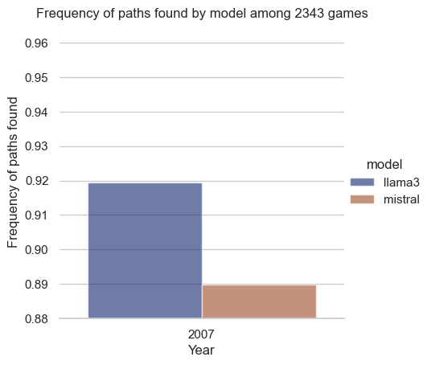

<!--
TEMPLATE DE DIALOGUE POUR AVOIR LES IMAGES CORRECTEMENT:

   

      

      

      text marty with crazy icon
      

   

   

      

      text doc with crzay icon
      

      

   

   

      

      

      text marty with normal icon
      

   

   

      

      text doc with normal icon
      

      

   

-->

<!-- 
# TEMPLATE TO CREATE SUMMARY HEADINGS ON THE SIDE
<h2 id="section1">Section 1</h2>

Content for section 1...

<h2 id="section2">Section 2</h2>

Content for section 2...

<h2 id="section3">Section 3</h2>

Content for section 3...
 
-->

**Welcome to our ADA project ! Follow Marty and Doc through their adventures exploring ✨the Wikispeedia Dataset✨**

   

      

      

      Hey Doc! What's up? You know, this web game, Wikispeedia? I've been playin' it a few times and it's way harder that I thought it would be.
      

   

   

      

      What are you talking about Marty? You know your old Doc, I am not quite into online games or whatsoever.
      

      

   

   

      

      

      Ok, ok, hear me out:
      

   

{: .box-warning}
   **🎮 Wikispeedia 🎮** \
   Wikispeedia is a game where you start from one Wikipedia article and try to reach another article only by navigating through the links you can find on the pages. The goal of the game is to be as fast as possible but there is no restriction in time ! 

[Play Wikispeedia here !](https://dlab.epfl.ch/wikispeedia/play/)

   

      

      

      You can play Wikispeedia <a href="https://dlab.epfl.ch/wikispeedia/play/" target="_blank" rel="noopener noreferrer">here!</a>
      

   

   

      

      Fascinating! Marty, you are saying it is harder that you thought, how so?
      

      

   

   

      

      

      Yeah Doc, sometimes I don't even now the target so I try but I just fail… Or I just keep going back and forth between articles because they just don't look like how I expected them to be, at all! It seems like they are not the Wikipedia articles that I know and they don't have the next link I was looking for, things like that… Is this game too old for me? Am I just bad at this game?
      

   

   

      

      Hmm I see… Well Marty, you just gave me a BRILLIANT idea! Let us inspect this game and see how people performed on it since it's been created!
      

      

   

   

      

      

      Sure Doc, take the lead!
      

   

In this project we use the data that players create by playing Wikispeedia. This data was collected by the [EPFL Data Science Lab (dlab)](https://dlab.epfl.ch/)

~ Presentation of the dataset by Doc ~

# Part 1: How are people performing in Wikispeedia?

   

      

      The articles present in the Wikispeedia dataset have categories. Do these categories influence your success, Marty? Let's explore that together!
      

      

   

   

      

      

      Tell me Doc, what do the categories look like?
      

   

## 1.A. Categories

### 1.A.1. Article categories and destination of the links
For most articles, one main category is followed by more precise subcategories. For example, the mixed-breed dog article has the main category "Science", first subcategory "Biology" and second subcategory "Mammals". For simplicity, we will keep only the first category, i.e. the main one. You can take a look at the distribution of those main categories here.

<!--

First, what do the categories look like? For most of them, one main category is followed by more precise subcategories. For example, the mixed-breed dog article has the main category "Science", first subcategory "Biology" and second subcategory "Mammals". For simplicity, we will keep only the first category, i.e. the main one. You can take a look at the distribution of those main categories here. HERE::\<insert image of Einstein the dog\>

HERE:: more analysis?

Second, we notice that among the 4598 articles, some have more than 1 main category: we count 590 articles with 2 main categories and 8 articles with 3. It complicates our analysis. To keep things simple, we will impose rules on which main category we think is the most important for the article considered. For this, we have created a partial ordering in the categories, based on what we could observed. The reasoning is explained on this page. HERE:: insert link to partial ordering page.
-->

<iframe 
    src="/ada-outlier-datastory/assets/img/pie_cat.html" 
    class="responsive-iframe" 
    title="Pie chart of the categories"
    height="550px">
</iframe>

<!--

   

      

      

      Wow! Back in 2007, science articles represented almost 1/4 of the encyclopedia, whereas art articles comprised less than 1% of it.
      

   

   

      

      You're right! Let's now look at the links between the articles: from which to which categories go the links? Do they lead to an article from the same category or to another? Is it easy to navigate to another category?
      

      

   

-->

Back in 2007, science articles represented almost 25% of the encyclopedia, whereas art articles comprised less than 1% of it. 

Let's first look at the links between the articles: from which to which categories go the links? Do they lead to an article from the same category or to another? Is it easy to navigate to another category? Each row corresponds to the category of the articles that the links come from, and each column corresponds to the category of the articles reached by the links. 

<iframe src="/ada-outlier-datastory/assets/img/links_categories.html" 
   class= "responsive-iframe"
   width="900px" height="840px" alt='links_categories'></iframe>

<!-- INITIAL TEXT:
Wow, lots of information on this plot! First, the diagonal, i.e. links staying in the same category has bigger values compared to the lines or columns in general. Then, we can observe that the brighter columns are the ones from science, geography and countries. For science and geography, it makes sense as these are the most represented categories as we have seen previously. On the other hand, it seems very easy to reach articles about countries: there are more than twice of links pointing to countries as links going out from countries. It seems logical as for many concepts, the place of invention discovery or birth is mentioned, including the country. Science articles are the ones linking out the least to other categories, with only 41% of links going elsewhere than in science articles. With these data in mind, are there categories of articles that are harder to guess?

To answer this question, we can investigate the categories of starting articles and target articles of the players.

BUBBLES AND PLAIN TEXT:
-->

   

      

      

      Wow, lots of information on this plot! Help me there Doc!
      

   

   

      

      Don't worry Marty, we just need to break this into small steps. Here:
      

      

   

First, the diagonal that represents links staying in the same category has bigger values compared to the lines or columns in general. Then, we can observe that the brighter columns are the ones from Science, Geography and Countries. It means that a higher proportion of links lead to those categories. For science and geography, it makes sense as these are the most represented categories as we have seen previously. On the other hand, it seems very easy to reach articles from the Countries category: 23% of the links lead to it! It seems logical as for many articles, a location is mentioned (place of discovery or birth, where an event took place, etc), including the country. Science articles are the ones linking out the least to other categories, with only 41% of links going elsewhere than in science articles.

   

      

      

      Ok I see! But then, does this mean that there are categories of articles that are harder to guess?
      

   

   

      

      To answer this question Marty, we can investigate the categories of starting articles and target articles of the players!
      

      

   

### 1.A.2) Success and categories

   

      

      

      Hah! Leave it to me Doc…
      

   

   

      

      Wait a second Marty! We have to clean a bit the data...
      

      

   

   

      

      

      What do you mean? What's wrong with the data?
      

   

   

      

      First, there are some articles that doesn't appears in `categories.tsv`... We don't know their categories. Thus, we will remove these games. Second, some players seemed not to take the game very seriously... They didn't even click on a link! We will also remove these paths.
      

      

   

   

      

      

      But don't we introduce a bias in this way?
      

   

   

      

      We get rid of only 0.16% of the finished paths and 21.18% of the unfinished paths. 21.18% can look big but most of the discarded paths have a length of 1, and the player didn't take any action! These paths are not exploitable, discarding them is our best option.
      

      

   

{: .box-note}
   **Some statistics:** \
      • number of games before cleaning: 76 048 \
      • success rate before cleaning: 67.4% \
      • number of games after cleaning: 70 842 \
      • success rate after cleaning: 72.3% \
      • percentage of games discarded: 6.8%

<iframe src="/ada-outlier-datastory/assets/img/categories_finished_paths_start2target_datastory.html" width="800px" height="850px" 
class="responsive-iframe" alt='categories_finished_paths_start2target'></iframe>

<iframe src="/ada-outlier-datastory/assets/img/categories_unfinished_paths_start2target_datastory.html" class="responsive-iframe" width="850px" height="850px" alt='categories_unfinished_paths_start2target'></iframe>

<!--

   

      
      

         Both heatmaps look similar! Should we conclude that there is no difference between finished and unfinished paths categories?
      

   

   

      

         We cannot conclude that quickly Marty. Let's perform a statistical test for that. In our case, we should use a chi2 contingency test: our null hypothesis is that both distributions are identical. What is meant by distribution is a vector of 15x15 that contains the count of links from the start category to the end category. It's simply the data from the heatmap, in the form of counts. We choose a level of significance of alpha=0.01.
      

      
   
 

   

      
      

         Ok, let me see… The results are the following: `pvalue=0.0, statistic=2953.30`. And, the test gives the same results while comparing the distribution of link counts towards one target category (`statistic=207557.76`) or from one source category (`statistic=39997.79`).
      

   

   

      

         Great! We can thus safely reject the null hypothesis!
      

      
   
 

   

      

         If we dig into the details, we see that a few major differences occur. First, there is 4 times less target from the Countries category in among the unfinished paths, whereas there is 2 times more target from Design_and_Technology. There are also an increase of 66% of target articles in Everyday_life category.
      

      
   
 

   

      
      

         So apparently, finding an article in Countries category is easier than finding an article in Design_and_Technology or Everyday_life for example.
      

   

-->

Both heatmaps look similar! But what do the statistics tell us? Let's perform a chi2 contingency test: our null hypothesis is that the distributions are identical. 
What is meant by distribution is the frequency of links from a start category to an end category. Here we simply take the data from the heatmap, in the form of counts. We choose a level of significance of $$\alpha=1$$%. The results are the following: `pvalue=0.0, statistic=2953.30`. We can thus safely reject the null hypothesis!

We can also look at it in a more general way and compute the distribution of the start categories without looking at the target (indicated as `category → *` in the heatmap), and vice-versa (indicated as `* → category`), for both finished and unfinished paths. Reproducing the t-test for those distributions, we obtain the same pvalue of 0.0. We can thus also conclude that the distribution of the categories of the start and target articles are different between the finished and unfinished path datasets.

Let's dig through some details. A few major differences occur. First, there is in proportion 4 times less target articles from the Countries category among the unfinished paths, whereas there is 2 times more article target from Design_and_Technology. There are also proportionally 66% of target articles more in Everyday_life and Language_and_literature categories for the unfinished paths and and portion of Geography articles is divided by 1.6. it also happens for Music and Business_Studies categories, with proportionally 33% target articles more. 

If we are looking to the source article category, there exist less disparities. We can however note 66% source articles more from Design_and_Technology and 43% more for the Music category.

We can then hypothesize that finding an article in Countries category is easier whereas finding an article in Design_and_Technology or Everyday_life seems harder. In addition, it might be harder to start from Design_and_Technology or Music.

   

      

      

         Hah! We found why the players lose! Wasn't that hard.
      

   

   

      

      

         Hold on a second Marty! There might be other interesting factors…
      

   
 

## 1.B. Other factors of success

### 1.B.1) Shortest path

One can assume that the shorter the shortest path, the more likely it is to find a path, because navigating between the two articles requires less clicks. 

{: .box-note}
  The **shortest path** between two articles is given by the minimum number of links you must click to reach the desired article.

This is well illustrated in the following plot. The longer the shortest path, the fewer finished paths there are! The longest shortest path for which we have finished paths is 7, for which we have only 17 games played. There is an increase with the shortest path of the porportion of players that did not go far enough anyway to reach the target, as they stopped before even reaching the shortest path length. As we could expect, the largest success rate occurs with a shortest path of 1 and decreases while the shortest path increases, except for a shortest path of 4 that where the success rate is slightly higher than for 3. However, the results should be taken precautionously due to the very different number of games played for each shortest path.

<iframe src="/ada-outlier-datastory/assets/img/distrib_path_lengths_wrt_shortest_path.html" 
class="responsive-iframe" width="900px" height="550px" alt='distrib_path_lengths_wrt_shortest_path'></iframe>

### 1.B.2) Number of links to the target

Another parameter might be the number of links leading to the target: intuitively, the more there are the easier it is to reach the article. Let's work on this hypothesis. The following plot shows the distribution of the links to the target number depending on whether the player found the target. Both distribution shapes are similar, but the one from unfinished paths is shifted to the left and there is a peak at 1. Let's try a t-test of independence. Our null hypothesis is that the two distributions are identical. We obtain a p-value of 0 and a test statistic of 45.50. We can thus safely reject our null hypothesis and conclude that the two distributions are indeed different!

<iframe src="/ada-outlier-datastory/assets/img/distrib_links_to_target" width="900px" height="550px" alt='distrib_links_to_target'
class='responsive-iframe'></iframe>

   

      

      

        Interesting... But how can we evaluate the influence of each factor?
      

   

   

      

        Good question Marty! It's time for a good old logistic regression. 
      

      

   

## 1.C. Logistic regression

{: .box-note}
   **Logistic regression** is a supervised machine learning technique that allows to predict a binary outcome.
   In a **linear regression**, we have the **features** in a matrix $$X$$, made out of $$N$$ rows and $$r$$ columns, with $$N$$ and $$r$$ respectively the numbers of samples $$x\in\mathbb{R}^r$$ and features. We train the model with $$X$$ and a vector $$Y\in\mathbb{R}^N$$ that contains the ground truth. Then, our model is ready to predict the result for new samples: it computes $$f(x)=Ax+b=y_\text{pred}$$ with $$A$$ and $$b$$ the fitting coefficients. \
   \
   In the case of logistic regression, we want to predict the probability of the outcome to be 0 or 1. The problem is that the linear regression can give us any number, not necessarily between 0 and 1 as a probability should be. To fix this issue, we will train the model to deal with log odds that range from $$-\infty$$ to $$\infty$$. The odds are defined are $$p/(1-p)$$ for a given probability $$p$$.  Thus, a logistic regression is the equivalent of a linear regression modelling the log odds, with \
   $$\begin{equation*}
   f(x)=y_\text{pred}=\frac{1}{1+\exp(-\beta^Tx)}
   \end{equation*}$$ \
   where $$\beta\in\mathbb{R}^r$$ are the coefficients to fit.

We first prepare the data: we split it in training, validation and testing datasets. 80% of the samples goes in training, whereas validation and testing gather 10% of the samples each. We use a logistic regression model that we fit on the training set. The data is quite unbalanced: more than 70% of the games are wins! We thus use sample weights to mitigate this effect. We fix the level of significance for the coefficients at 0.01. Here are the coefficients with pvalue below the significance threshold:
<iframe src="/ada-outlier-datastory/assets/img/results_log_reg_cat.html" 
class="responsive-iframe" width="1500px" height="600px" alt='results_log_reg'></iframe>

   

      

      

        Oh wow! It looks like you were right about the trends Doc! But how do we interpret all of this?
      

   

   

      

        It looks nice indeed! Let's have a closer look.
      

      

   

{: .box-note}
   In the case of a continuous predictor, a positive (resp. negative) coefficient $$\beta$$ means that the log odds of the outcome are increased (resp. decreased) by $$\beta$$ per standard-deviation increase of the corresponding predictor. For a binary predictor taking values 0 or 1, it represents an increase (resp. decrease) by $$\beta$$ if the binary predictor takes a value of 1. \
   The change in probabilities follows the trend of the log odds one but depends on the initial value of the probability.

As we were stating it previously, the probability of finding an article is increased when the article belongs to the Geography or Countries category! It is also true for Mathematics. On the other hand, it is harder to reach an article in the Design_and_Technology category or Language_and_literature: the odds are decreased of 41%! It is also true for target articles  in the Everyday_life category that decrease the odds by 36%. The only source category that has a significant impact is again Design_and_Technology. It matches quite well our previous observations.

The longer the shortest path, the smaller the probability of success is: it decreases the odds of 8% for an increase of 1 of the shortest path. It coincides with the success rate observed previously, that decreases the longer the shortest path. As expected, the opposite effect happen for the number of links to target: having 93 more links pointing to an article multiplies the odds of finding it by 2.36. It also agrees with our previous hypotheses.

   

      

      

        But how do we know if our model is good?
      

   

   

      

        Let's use the validation and test sets to address your question!
      

      

   

For each game data, the model gives us a probability of success. To asses the model quality, we then have to choose what is threshold above which probability a game will be classified as a success. For this, we try different thresholds on the validation and select the one that gives the better macro-averaged F1-score. It turns that for our model, the best macro-averaged F1-score is 0.61 for a threshold of 0.4242. We thus choose the latter for the following. 

We can now evaluate the model performance on the test set!

{: .box-note}
   **How to evaluate the model quality 101** \
   • ROC AUC: it represents the area under the curve of the receive operator curve. To keep it simple, a value 0.5 means that the model is as good as a random classifier, i.e. that predicts one half as success and the other one as failure. The maximum value of 1 means perfect predictions. The closer the value to 1, the better is the model. \
   • Confusion matrix: a table showing the number of samples correctly or wrongly classified as a success or a failure. It contains all the necessary data to compute the following metrics. \
   • Accuracy: proportion of correct predictions \
   • Precision: proportion of real wins among samples classified as win \
   • Recall: proportion of reals wins classified correctly \
   • F1-score: harmonic mean of recall and precision. In a nutshell: combine recall and precision in a unique metric to find the best tradeoff.

   

      

      

        Wait a minute... you were talking about macro-averaged F1-score above. What do you hide me?
      

   

   

      

        Well, this one is a bit trickier than usual! These metrics can give very high value even if the model predicts always a win! This is due to the unbalance of the data: we have much more wins than defeats... But trust me, we'll sort it out!
      

      

   

{: .box-note}
   **How to evaluate the model quality 102** \
   The metrics previously presented do not assess how good the model can predict negative sample. Here are some metrics to address the problem. \
   • Specifity: like the recall but for the defeats, i.e. proportion of real defeats classified correctly. \
   • Balanced accuracy: average of recall and specificity \
   • Macro-averaged F1-score: average of F1-score for wins and F1-score for defeats 

Now we are ready to assess the model quality on the test set. Here is the confusion matrix that allows to compute the metrics previously mentioned.

| 7085 samples in the test set | Predicted as win (4962) | Predicted as defeat (2123) |
| :-----: | :---: | :---: |
| **Real win (5197)** | 3943 | 1254 |
| **Real defeat (1888)** | 1019 | 869 |

First, the ROC AUC gives us a value of 0.67, showing sensibly better performance than a random classifier. Second, the macro-averaged F1-score is 0.61 and the balanced accuracy is 0.68. The main reason between this reserved performance is the difficulty that has the model to identify defeats. Indeed, the specificity is only 0.46! So if we have a game lost, the model classifies as such only 46% of the time. The recall is a bit better with 0.76. The precision is 0.79. It means that if the model classify a game as a win, there is 4 chances over 5 that the prediction is correct. However, when the model classifies a game as a defeat, it is correct only 41% of the time! This is due to the unbalance between the number of wins and defeats among the samples as mentioned previously.

   

      

      

        I'm a bit disappointed Doc... 
      

   

   

      

        I understand you Marty. We might lack of data on players to developp a better model, for example their age, their origin, their education level. But the model still identify quite well the games that will be won!
      

      

   

   

      

      

        And now? What can we do with this? 
      

   

   

      

        Come with me, we still have a lot to discover! I think it's time for a small trip in the future...
      

      

   

<h2 id="section1">Section 1</h2>

Content for section 1...

# Part 2: How did Wikipedia's structure evolve since 2007?

Let us now compare the differences between the old Wikipedia from 2007 and our current Wikipedia from 2024. The first factor that could influence the performances of the players is the number of links per articles. Wikipedia is expanding everyday thanks to its collaborative process and has significantly improved and grown since 2007. Let's see how much that changes compared to now ! 

## 2.A. Number of links 

{: .box-note}
  **Basic Comparison:** \
  2007 : 119882 links \
  2024 : 225800 links

As a first analysis, let's just compare basic statistics on the two different Wikipedias, such as the number of links per article on average and its distribution: 

As expected, there is much more links per page **on average** in our 2024 dataset! The distribution also shows that more pages have a higher number of links. This could probably influence users' performances. 

  

    

    

        Cool! So that's why the game is harder in 2007?
    

  

  
  

      

        Wait a bit Marty let's look more into the details before driving any conclusions. Let's look at individual articles:
      

      

  

In the plot below, we visualize every article within our dataset of the 4604 selected articles from the Wikispeedia game on the x axis and compute the difference in the number of links between the two timepoints. Anything above zero, in green, represents more links in 2024 than in 2007, and anything below, in orange, corresponds to less links on the page in 2024 than in 2007.

  

        

          Overall we see that there is much more pages that gain new links than pages losing links in 2024 !
        

        

    

    

      

        Let's now move to the <b>interesting</b> part : the network of the links...
      

      

  

## 2.B. Network differences 

For now, we only have been looking at the repartitions of links on the pages with no interest to where those links would redirect to, even though this is probably our most crucial information to conclude wheter the structure of 2024 has really changed compared to 2007. In this part we look at how the pages are interconnected and compare it for the two different years. To do so we will use the Shortest Path metric. 

  

        

          Hey Doc... What is actually the shortest path ? 
        

        

    

    

      

        Well Marty it's in the name ! The most direct path from one point to another in a network is the shortest path. We should look at how direct the connections between articles are in 2024 and see where it gets us.
      

      

  

{: .box-note}
   **Shortest Path Algorithm** \
  There exist different strategies to compute the shortest path. Here we have decided to use the Floyd-Warshall Algorithm from the 'Networkx' librairy. This algorithm provides the same result for the Shortest Path Matrix (*SPM*) as the one computed in the orginal dataset provided by the source article, when tested on the 2007 dataset.

First let's compare the average shortest path !

|   | in 2007 | in 2024 | P value |
| :------ |:--- | :--- | :--- |
| Average Shortest Path | 2.808365 | 2.452919 | ~0.0 |

We see that it **is** significantly shorter in 2024 than in 2007, which is a good sign for Marty!
To see more in details how this plays out, we create the following heatmap where we plot the SPM from 2007 minus the SPM from 2024 :

<iframe 
    src="/ada-outlier-datastory/assets/img/heatmap_difference.html" 
    class="responsive-iframe" 
    height="630px"
    title=" ">
</iframe>

In this plot, positive values represent when the shortest path is smaller in 2024 than in 2007, whereas negative values correspond to when the shortest path is longer in 2024 than in 2007. 
Apart for some big red or blue lines, that mean that the specific article is more (or less) connected to the whole database in 2024 than in 2007, it is difficult to get a general feeling for how the shortest path has changed between the two as the heatmap appears mostly white. We will need to look at other indicators then. 
Let's now look at the Strongly Connected Components for each graph. 

{: .box-note}
   **Strongly Connected Components (SCCs)** \
   SCCs are subparts of a graph where every node can be reached from every node in the SCCs. In our case, as we face directed graphs, this information is particularly useful : it is harder for the graph to form SCCs than for an undirected graph, as node A and B are in the same SCCs if and only if the path from A to B exist **and** the path from B to A exists too. To compare the structures of our networks we can look at the SCCs. 

The two networks share a globally similar SCCs structure : only 1 big SCC that contains most of the articles, a few SCCs of only 2 articles and the rest of the articles that are not part of any real SCCs. The proportions of each structure do however vary between the two years :

| SCCs  | in 2007 | in 2024 | 
| :------ |:--- | :--- | 
| Number of articles within the big SCC  | 4051 | 3910 |
| Number of articles outside any SCC | 512 | 683 |
| Number of SCCs of size 2 | 18 | 5 | 
| Overall Average Shortest Path Across SCCs | 1.1148 | 1.3110 |

  

        

          So what's your verdict Doc ? 
        

        

    

    

      

        Hmm... Still hard to conclude anything Marty! Both networks contain similarly sized SCCs but they still differ in the content of articles and different links... We should look at what articles are the most important in the networks too!
      

      

  

How can we investigate the 'importance' of an article in the network ? Different methods exist but we selected here the PageRank Centrality as our measurement of a page's importance. 

{: .box-note}
   **PageRank Centrality** 
   This measure represents how 'important' a node is by how many inlinks redirect to it from other central nodes. The more there are links redirecting to a node the more it is central, and the more central nodes redirect to a node, the more central this node gets. It is often used by web search engines to rank web pages, and thus is perfectly adapted to our analysis. 
   The pagerank centrality $$x_i$$ can thus be computed as follows : 
   $$ x_i = \sum_j a_{ji} \frac{x_j}{\sum_{j} a_{ji}} $$
   with $$a_{ji}$$ entry (j,i) of adjacency matrix $$A$$

We decide to plot the nodes that have a pagerank value in the top 0.5% for better visualization here. The size and colors of the nodes are linked to the nodes pagerank scores and allow us to visualize the centrality measurement on the following plots: 

<iframe 
    src="/ada-outlier-datastory/assets/img/pagerank2007.html" 
    class="responsive-iframe" 
    title=" ">
</iframe>
<iframe 
    src="/ada-outlier-datastory/assets/img/pagerank2024.html" 
    class="responsive-iframe" 
    title=" ">
</iframe>

Looking at those graphs, we can compare the articles the most 'central' in the pagerank sense in the two networks. What we see is that in 2007, the 'United_States' article really dominates the whole network and is the most connected to the others, with a pagerank centrality of 0.0096. 
In 2024, there is no such node really 'dominating' the rest. The top node becomes in turn 'World_War_II' with a centrality of 0.0038. The other articles in 2024 have a comparable centrality, and we see a network of mostly similar sized nodes, whereas in 2007 the network is really disequilibrated between the top node and the other 0.5% top nodes. Overall, the network for 2024 seems more balanced than in 2007, but almost the same nodes remain top ones, being mostly countries names. 

<!--  -->

  

        

          And so what do you conclude Doc ? 
        

        

    

    

      

        It's difficult Marty... Hard to say how those differences in the networks would impact the players. Let's just look at the Hop Distance Distribution plot before finishing up !
      

      

  

{: .box-note}
   **Hop Distance Distribution Plot** \
   Another interesting characteristic of networks can be visualized through what is called an Hop Distance Distribution Plot (or a Reachability Plot). We are plotting the average number of reachable nodes versus the number of hops needed to reach them. This plot represent how many articles we can reach on average after a certain number of clicks. This kind of plot can provide information on : \
   • The network diameter \ 
   • The Presence of Hubs \
   • The Efficiency of Routing in the network

On this plot, we can compare the reachability of the two networks: 

We can observe a few things: first, the 2024 curve does not plateau at the same value as the 2007 one. This can be explained by a few factors: in our 2024 dataset, some articles from 2007 have been deleted and thus will never be reachable in 2024. There are also some articles that may have lost all their incoming links in 2024 because the links structure got completely changed and more specialized. Thus no links from the selected 4604 could redirect to them as there were not close enough. 
Secondly, we see that both curves follow the same pattern, with a very sharp increase, almost exponential, and then reaching a plateau. This is a typical behaviour of internet networks and reflects a good connectivity and efficiency of routing. With each link clicked, the increase in average reachable nodes is extremely big. The biggest increase in both curves occurs between hop 2 and 3. This reveals the presence of central hubs that allow redirection to many other nodes when reached. This information is also reflected by the very small average shortest paths that we have observed earlier on.
Finally, we observe that the plateau is reached sooner in the case of 2024 : after only 5 hops versus 6 in 2007. Again this shows that the network in 2024 is probably easier to naviguate than in 2007 : in 5 hops you can reach the maximum average number of reachable nodes. 

{: .box-note}
   **Clustering Coefficient** 

If we look at the clustering coefficients of the graphs we observe the following values : 

|   | 2007 | 2024 |
| Average clustering coefficient | 0.19 | 0.26 |

Again, the clustering seems to be higher in 2024 than in 2007 ! This should also improve the connectivity of the network. 

## 2.C. Conclusions on the structural differences observed

As we saw, many differences exist between the 2 networks, but it is hard to conclude wheter this would render a 2024 version of the Wikispeedia game easier to play or not. Our intuition is that it should be the case, as on average the shortest path is smaller and the number of links per page is bigger in 2024. Moreover as we just saw, the number of hops needed to reach the average number of nodes is smaller too. However we still cannot infer based on this that the game would be easier for the players, and will thus see how the differences in structure that we have studied could impact the paths played in 2007.

  

        

          I think I get it this time, Doc! We cannot really know for sure that the game would be easier in 2024 because, well, we haven't tried it yet !
        

        

    

   

      

        Precisely Marty ! We have a pretty good proof that the two networks are different enough in how they are structured but how can we know if one is easier than the other ? 
      

      

  

  

        

          I know what we can do, let's look at how our new wikipedia structure of 2024 could impact the games played in 2007!
        

        

    

## Part 3 : What are the possible consequences of Wikipedia’s changes in player’s performances ?

### 3.A. Player's path analysis

   

      

      

      We saw that there are several changes in the structure of wikipedia, but what are the possible consequences of these changes on the player's performances ?
      

   

   

      

      I don't know Marty, but we can analyze the player's path to see if he could reach in theory the target page in less clicks in 2024 than in 2007.
      

      

   

To analyze the player's path, we will analyze the case where the player's path is unfinished and finished. First, we will process the player's path to detect if the target was encountered by the player during his game. Then, we will count the number of paths that could have been shortened and compare the number of clicks that could be saved by the players in the structure of wikipedia in 2007 and 2024 based on the current path choosen by the player.

[CONCLUSION] (2024 shortened more paths, but the number of clicks saved by 2007 is greater.)

We observe on both unfinished and finished paths graphs above that the structure of wikipedia in 2024 allows to shortened more paths than in 2007 and the number of clicks saved is greater in 2024 than in 2007. 
Based on this results, we can conclude that the structure of wikipedia in 2024 would allow to players to reach the target page in less clicks than in 2007.

### 3.B. Structural comparison

   

      

      

      Hmmmm, we just saw that the player's path is different, but how can we compare the structure of the wikipedia in 2024 and now ?
      

   

   

      

      Don't worry let me show you how we can compare the efficiency of Wikipedia's structure in 2007 and 2024!
      

      

   

{: .box-note}
   To compare wikipedia's structure between 2007 and 2024, we compute the similarity between articles based on their content and structure. We use two methods: `Node2Vec`, which captures the graph structure, and `Sentence-BERT`, which analyzes textual content. We will observe the evolution of both structural and content-based similarity between articles in 2007 and 2024 and then combine them to get the similarity score of each article. 
   \
   \
   The similarity is calculated as follows: $$ \begin{equation}
      \text{similarity score}(article) = \frac{1}{n} \sum_{i=1}^{n} \text{similarity}(article, article_i)
   \end{equation} $$\
   where $$n$$ is the number of outgoing links of the article, and $$article_i$$ is the $$i$$-th article linked to the article.\
   \
   Then, our similarity score is the average of the similarity scores obtained with the two methods.\
      $$ \text{similarity}(a_1, a_2) = \frac{1}{2} \left( \text{similarity}(a_1, a_2)_{\text{Node2Vec}} + \text{similarity}(a_1, a_2)_{\text{Sentence-BERT}} \right) $$\
   where $$a_1$$ and $$a_2$$ are two articles.

First let's see the structural and content-based similarity between articles in 2007 and 2024.

We can observe a slight improvement in the similarity for both structural and content-based similarity between articles in 2024 compared to 2007. The similarity between articles in 2024 is higher than in 2007, which indicates that the structure of Wikipedia has evolved to be more coherent and organized.

The combined similarity score of each article is calculated by taking the average of the structural and content-based similarity scores. The combined similarity score is then used to compare the structure of Wikipedia in 2007 and 2024.

Again, we observe that the distribution of the combined similarity scores of articles in 2024 is slightly higher than in 2007. But is this difference significant? Let's perform a t-test to compare the two distributions. We choose a significance level of $$\alpha=5$$% and we obtain a `p-value` = $$2.59 \times 10^{-13}$$ and a `statistic` of $$-7.32$$. Thus, we reject the null hypothesis and conclude that there is a significant difference between the two groups.

The evolution of Wikipedia's structure from 2007 to 2024 has led to an improvement in the similarity between articles. The structure of Wikipedia in 2024 is more coherent and organized than in 2007.s

# Part 4: Are the players(LLMs) stronger in 2024 than in 2007 ?

  

    

    
Doc, we have seen that the structure of Wikipedia has evolved since 2007. But are the players stronger in 2024 than in 2007?

  

  

    

    
I don't know Marty, we don't have any data about the players in 2024.

  

  

    

    
But we have the data from 2007, can't we compare the two years?

  

  

    

    
We might be able to do that, let me think about it... we can use my favorite tool LLMs &lt 3 to compare the two years.

  

  

    

    
LLMs? But, the results will differ from the ones we got from the players's data, right? And which model should we use? Can you explain me how you are going to do it?

  

We will test out **llama3 8B** and **mistral 7B** models on the 2007 data and compare the results to the players's data. The design of the prompts is inspired by the group [Human vs AI](https://drudilorenzo.github.io/ada-klech-data-story/).

First we give the context of the game Wikispeedia to the model

*We now play the following game:*

*I will give you a target word and a list from which you can choose an option. If the available options contains the target word, you choose it. Otherwise you choose the option that is most similar to it. Before starting, I give you one examples, then it's your turn:*

*you need to follow the same format as the example below: 
Target word: George_Washington*

*Available options: [Able_Archer_83, Afghanistan, , Estonia, Europe, Finland, France, French_language, George_W._Bush, Hungary, September_11,_2001_attacks, United_States]*

*Reasoning: I need to find something inside the list related to the target: 'George_Washington'. George Washington was the first president of United States and he lived in United States.*

Then we give the llm the target word and the list of options:

*I will give you a target word and a list from which you can choose an option. If the available options contains the target word, you choose it. Otherwise you choose the option that is most similar to it* 

*Target word: [{target}]*

*Available options: [{links}]*

*RESPECT THIS FORMAT WHEN ANSWERING:*

*Reasoning: [REASONING]*

*Answer: Hence the choice is: '[ANSWER]'*

We will repeat this prompt with the new available options until the llm finds the target word or the prompt reaches 50 iterations. The number of prompt if define with the path length distribution of the players that we can see below

First, we want to see if the models are able to find a path between the source and the target articles.

llama3 seems to find more paths than mistral.

Then, we want also compare the performance of the models with the players. See if the path length is similar between the players and the models.

<!-- <iframe src="assets/img/performance_scatter.html" width="100%" alt='models_performance' frameBorder="0"></iframe> -->

llama3 falls in 78.5% of the cases in the confidence interval of the players, while mistral falls in 69.1% of the cases.

But, does the model find the same path as the players? We can compute the Jaccard similarity between the paths of the players and the models to determine if the path contains the same articles.

The Jaccard similarity shows that neither llama3 nor mistral use the same path as the players. They both shows similar results.

Finally, based on the result we can says that boths models don't act like a players. But llama3 find more paths than mistral and falls in the confidence interval of the players in 78.5% of the cases.

## LLMs performance between 2007 and 2024

# References

[1] Robert West and Jure Leskovec:
     Human Wayfinding in Information Networks.
     21st International World Wide Web Conference (WWW), 2012.
     
[2] Robert West, Joelle Pineau, and Doina Precup:
     Wikispeedia: An Online Game for Inferring Semantic Distances between Concepts.
     21st International Joint Conference on Artificial Intelligence (IJCAI), 2009.

